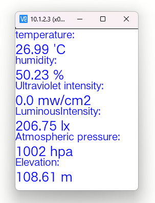

# README

Modify the raspberrypi library for this sensor to pinpong for unihiker

# Print on termial

```bash
root@unihiker:~# git clone https://github.com/liliang9693/DFRobot_EnvironmentalSensor
Cloning into 'DFRobot_EnvironmentalSensor'...
remote: Enumerating objects: 394, done.
remote: Counting objects: 100% (394/394), done.
remote: Compressing objects: 100% (198/198), done.
remote: Total 394 (delta 189), reused 262 (delta 107), pack-reused 0
Receiving objects: 100% (394/394), 136.80 KiB | 463.00 KiB/s, done.
Resolving deltas: 100% (189/189), done.
root@unihiker:~# cd DFRobot_EnvironmentalSensor/
root@unihiker:~/DFRobot_EnvironmentalSensor# ls
examples  keywords.txt  library.properties  LICENSE  python  README_CN.md  README.md  src
root@unihiker:~/DFRobot_EnvironmentalSensor# cd python/unihiker/
root@unihiker:~/DFRobot_EnvironmentalSensor/python/unihiker# ls
DFRobot_Environmental_Sensor.py  example_read_data_display_on_screen.py  example_read_data.py  README.md  Snipaste.png
root@unihiker:~/DFRobot_EnvironmentalSensor/python/unihiker# python example_read_data.py

  ___________________________
 |                           |
 |      PinPong v0.5.2       |
 |    Designed by DFRobot    |
 |___________________________|

[01] Python3.7.3 Linux-4.4.143-67-rockchip-g01bbbc5d1312-aarch64-with-debian-10.13 Board: UNIHIKER
selected -> board: UNIHIKER serial: /dev/ttyS3
[10] Opening /dev/ttyS3
[32] Firmata ID: 3.8
[22] Arduino compatible device found and connected to /dev/ttyS3
[40] Retrieving analog map...
[42] Auto-discovery complete. Found 30 Digital Pins and 30 Analog Pins
------------------------------
All right. PinPong go...
------------------------------
Sensor  initialize success!!
-----------------------

Temp: 26.99 'C

Temp: 80.58 'F

Humidity: 50.34 %

Ultraviolet intensity: 0.0 mw/cm2

LuminousIntensity: 197.45 lx

Atmospheric pressure: 1002 hpa

Elevation: 108.61 m


^Cuser quit process

```

# Display on screen

```bash
root@unihiker:~/DFRobot_EnvironmentalSensor/python/unihiker# ^C
root@unihiker:~/DFRobot_EnvironmentalSensor/python/unihiker# ^C
root@unihiker:~/DFRobot_EnvironmentalSensor/python/unihiker# ls
DFRobot_Environmental_Sensor.py         example_read_data.py  README.md
example_read_data_display_on_screen.py  __pycache__           Snipaste.png
root@unihiker:~/DFRobot_EnvironmentalSensor/python/unihiker# python example_read_data_display_on_screen.py

  ___________________________
 |                           |
 |      PinPong v0.5.2       |
 |    Designed by DFRobot    |
 |___________________________|

[01] Python3.7.3 Linux-4.4.143-67-rockchip-g01bbbc5d1312-aarch64-with-debian-10.13 Board: UNIHIKER
selected -> board: UNIHIKER serial: /dev/ttyS3
[10] Opening /dev/ttyS3
[32] Firmata ID: 3.8
[22] Arduino compatible device found and connected to /dev/ttyS3
[40] Retrieving analog map...
[42] Auto-discovery complete. Found 30 Digital Pins and 30 Analog Pins
------------------------------
All right. PinPong go...
------------------------------
Sensor  initialize success!!
^Cuser quit process
^C
root@unihiker:~/DFRobot_EnvironmentalSensor/python/unihiker#
```



